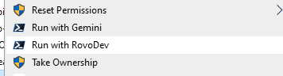
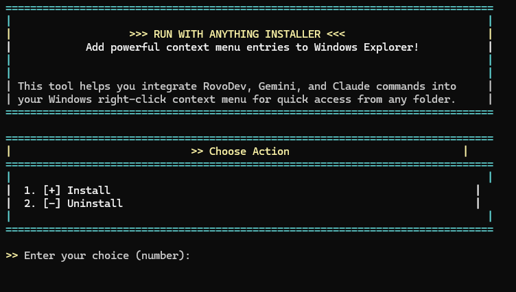

# Run with AnyThing

This project provides a convenient way to run `acli.exe rovodev run` or `gemini` from any directory via a right-click context menu entry in Windows File Explorer.

## Features

*   **Context Menu Integration:** Adds "Run with RovoDev" and "Run with Gemini" options to the right-click context menu for directories and also to the empty space within a folder (background).

    

*   **Automatic PowerShell Detection:** Automatically detects and uses `pwsh.exe` (PowerShell Core) or `powershell.exe` (Windows PowerShell).
*   **Administrator Privileges Check:** Ensures the installation script is run with necessary administrator privileges.
*   `acli.exe` executable (the script will prompt for its path if not found in the same directory, only for RovoDev option)
*   `gemini` command available in your system's PATH (only for Gemini option)

## Requirements

*   Windows Operating System
*   PowerShell (version 5.1 or PowerShell Core 7+)

## Installation

1.  **Download the project:** Clone or download this repository to your local machine.
2.  **Run the installation script:**
    *   Right-click on `install_run_with_AnyThing.ps1` and select "Run with PowerShell" or "Run as Administrator".
    *   The script will check for administrator privileges and prompt you if needed.

    

    *   You will be prompted to enter 'RovoDev' or 'Gemini' to choose which context menu entry to manage.
    *   You will also be prompted to enter 'Folder' to add to the folder context menu or 'Background' to add to the folder background context menu.
    *   If you choose 'RovoDev' and `acli.exe` is not found in the same directory as the script, you will be prompted to enter its full path (e.g., `C:\Program Files\RovoDev\acli.exe`).

    Alternatively, you can manually add the registry entries by double-clicking `add_run_with_RovoDev.reg` or `add_run_with_Gemini.reg` (this also requires administrator privileges).

## Uninstallation

To remove the "Run with RovoDev" or "Run with Gemini" context menu entry:

1.  **Run the installation script again:** Running `install_run_with_AnyThing.ps1` and choosing the option (RovoDev or Gemini) when the entry already exists will remove it.

    Alternatively, you can manually remove the registry entries by double-clicking `remove_run_with_RovoDev.reg` or `remove_run_with_Gemini.reg` (this also requires administrator privileges).

## How it Works

The `install_run_with_AnyThing.ps1` script performs the following actions:

1.  Checks if it's running with administrator privileges.
2.  Prompts the user to choose between 'RovoDev' and 'Gemini' functionality.
3.  Prompts the user to choose between 'Folder' and 'Background' context menu locations.
4.  Detects the preferred PowerShell executable (`pwsh.exe` or `powershell.exe`).
5.  Based on the user's choices, it creates or removes the appropriate registry keys:
    *   `HKEY_CLASSES_ROOT\Directory\shell\Run with RovoDev` (for RovoDev option on folders)
    *   `HKEY_CLASSES_ROOT\Directory\shell\Run with RovoDev\command` (for RovoDev option on folders)
    *   `HKEY_CLASSES_ROOT\Directory\shell\Run with Gemini` (for Gemini option on folders)
    *   `HKEY_CLASSES_ROOT\Directory\shell\Run with Gemini\command` (for Gemini option on folders)
    *   `HKEY_CLASSES_ROOT\Directory\Background\shell\Run with RovoDev` (for RovoDev option on background)
    *   `HKEY_CLASSES_ROOT\Directory\Background\shell\Run with RovoDev\command` (for RovoDev option on background)
    *   `HKEY_CLASSES_ROOT\Directory\Background\shell\Run with Gemini` (for Gemini option on background)
    *   `HKEY_CLASSES_ROOT\Directory\Background\shell\Run with Gemini\command` (for Gemini option on background)
6.  Sets the default value of the chosen menu entry (e.g., "Run with RovoDev" or "Run with Gemini") and its icon to the PowerShell executable.
7.  Sets the default value of the `command` key to a PowerShell command that navigates to the selected directory and executes either `acli.exe rovodev run` (for RovoDev) or `gemini` (for Gemini).

The `.reg` files provide a direct way to add or remove these registry entries without running the PowerShell script, though they still require administrator permissions. 